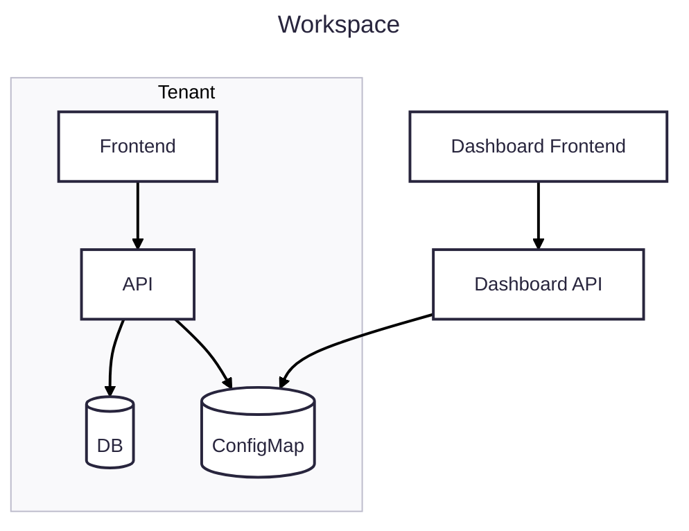

```mermaid
---
config:
      theme: redux
title: Workspace
---
flowchart TD
    subgraph TENANT[Tenant]
        FE[Frontend]
        API[API]
        DB[(DB)]
		CONFIGMAP[(ConfigMap)]

        FE --> API
        API --> DB
		API --> CONFIGMAP
    end
    FEDASH[Dashboard Frontend]
    DASHAPI[Dashboard API]

	FEDASH --> DASHAPI
	DASHAPI --> CONFIGMAP
```
