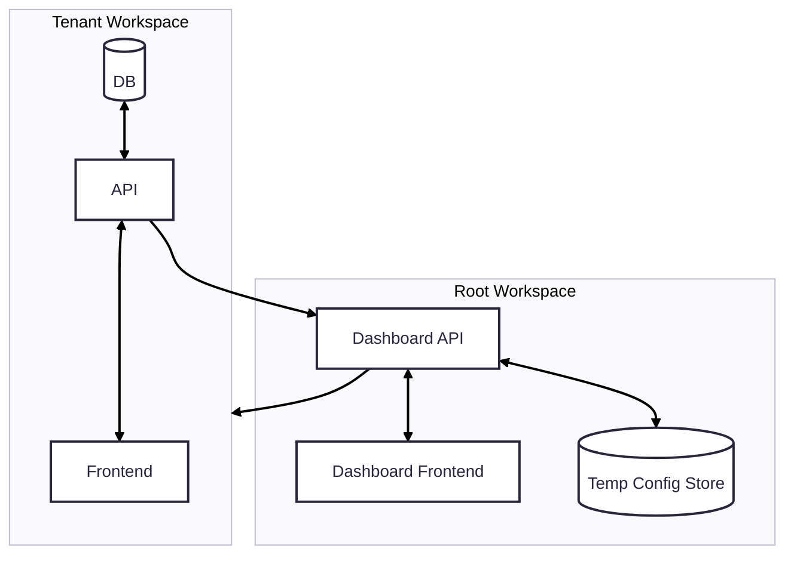

```mermaid
---
config:
      theme: redux
---
flowchart TD
    subgraph TENANT[Tenant Workspace]
        FE[Frontend]
        API[API]
        DB[(DB)]

        API <--> FE
        DB <--> API
    end
    subgraph ROOT[Root Workspace]
        FEDASH[Dashboard Frontend]
        DASHAPI[Dashboard API]
        TEMP[(Temp Config Store)]

		DASHAPI <--> TEMP
    end
	API --> DASHAPI
	DASHAPI <--> FEDASH
	DASHAPI --> TENANT
```
