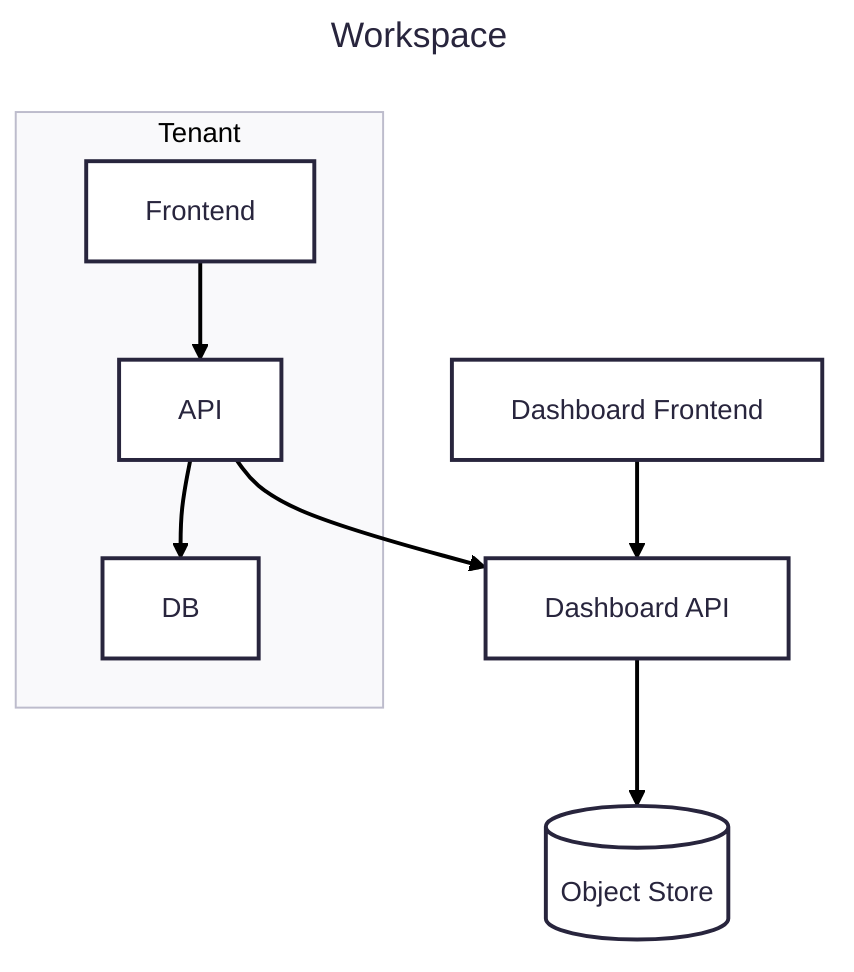

```mermaid
---
config:
      theme: redux
title: Workspace
---
flowchart TD
    subgraph TENANT[Tenant]
        FE[Frontend]
        API[API]
        DB[DB]

        FE --> API
        API --> DB
    end
    FEDASH[Dashboard Frontend]
    DASHAPI[Dashboard API]
    OBJECTSTORE[(Object Store)]

    FEDASH --> DASHAPI
    DASHAPI --> OBJECTSTORE

    API --> DASHAPI
```
