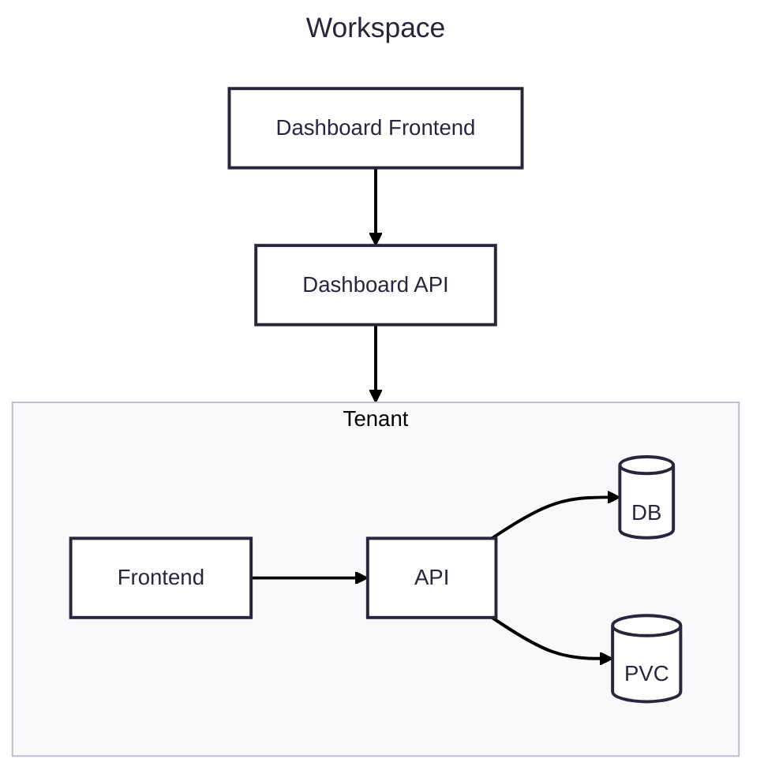

```mermaid
---
config:
      theme: redux
title: Workspace
---
flowchart TD
    subgraph TENANT[Tenant]
        FE[Frontend]
        API[API]
        DB[(DB)]
		PVC[(PVC)]

        FE --> API
        API --> DB
		API --> PVC
    end
    FEDASH[Dashboard Frontend]
    DASHAPI[Dashboard API]

	FEDASH --> DASHAPI
	DASHAPI --> TENANT
```
